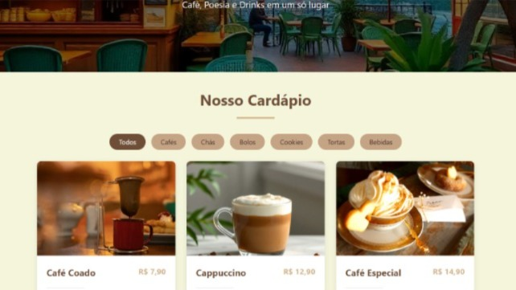

# Cardápio Poema Café

|  |  | |
| ---------------------------- | --------------------- | ----------------------|

## Descrição

O Poema Café é um projeto de cardápio online que combina a experiência de um café com a apreciação da poesia. Este site apresenta um cardápio interativo e dinâmico, totalmente gerenciado por JavaScript.

Os usuários podem filtrar os itens por categoria (cafés, bolos, cookies, bebidas, etc.), e a interface é renderizada dinamicamente, facilitando a manutenção e a adição de novos produtos.

---

## 🎨 Screenshot

 

---

## Funcionalidades

* **Renderização Dinâmica:** Os itens do cardápio são gerados via JavaScript a partir de um array de dados, mantendo o HTML limpo e semântico.

* **Filtro de Itens:** Os itens podem ser filtrados por categoria (Todos, Cafés, Bolos, Cookies, Tortas, Bebidas).

* **Design Responsivo:** O layout se adapta a diferentes tamanhos de tela, garantindo uma boa experiência em dispositivos móveis e desktops.

---

## Tecnologias Utilizadas
- **HTML:** Estrutura semântica do site.
- **CSS:** Estilização, layout responsivo e design.
- **JavaScript (ES6+):** Manipulação do DOM, renderização dinâmica e lógica de filtro.

---

## Como Usar

1. Clone o repositório:
   ```bash
   https://github.com/EmillyAndradeDev/projeto-cardapio-cafe.git
   ```

2. Abra o arquivo ```index.html``` em seu navegador.
---


# Documentação do Projeto

### Estrutura do Código

A arquitetura do projeto separa claramente a estrutura, o estilo e o comportamento:

1. **HTML (`index.html`):** Atua como um "template" ou esqueleto para a página.
   - *Header:* Contém o título e o slogan.
   - *Main:* Inclui os botões de filtro e um ```<div class="menu-container">``` vazio, que é preenchido dinamicamente pelo JavaScript.
   - *Footer:* Informações de contato, horário e redes sociais.

2. **CSS (`style.css`)**
   - Utiliza **Variáveis CSS** (```:root```) para um tema de cores coeso (tons de marrom e bege) e fácil manutenção.
   - O layout principal do cardápio (```.menu-container```) é construído com **CSS Grid**, usando ```grid-template-columns: repeat(auto-fill, minmax(350px, 1fr))``` para criar um grid responsivo que se ajusta automaticamente ao espaço.
   - **Flexbox** é usado para centralizar conteúdo no header, alinhar os botões de filtro e organizar o rodapé.
   - Os itens do cardápio são estilizados como **"cards"** (```.menu-item```) com ```box-shadow``` e ```border-radius```.
   - **Efeitos de ```hover```** são aplicados para interatividade, incluindo uma leve translação no card (```transform: translateY```) e um zoom na imagem (```transform: scale```).
   - **Media Queries (```@media```)** são usadas para ajustar fontes e transformar o grid em uma coluna única (```grid-template-columns: 1fr```) em dispositivos móveis.

3. **JavaScript(```script.js```):** Núcleo da Aplicação.    
   - **```menuData``` (Array de Dados):** Um array de objetos que contém todas as informações dos itens do cardápio (nome, preço, descrição, imagem, categoria, etc.). Funciona como um "banco de dados" do projeto.    
   - **```renderMenu``` (Função):** Responsável por ler o array de dados e gerar o HTML correspondente para cada item, injetando o resultado no ```<div class="menu-container">```.     
   - **Lógica de Filtro:** Adiciona eventos de clique aos botões de filtro. Ao clicar, ele filtra o array ```menuData``` com base na categoria selecionada e chama a função ```renderMenu``` novamente com os itens filtrados.

### Como Funciona

1. **Carregamento:** Quando a página carrega (```DOMContentLoaded```), o script lê o array ```menuData``` e chama ```renderMenu``` pela primeira vez, exibindo todos os itens.

2. **Filtro:** Quando um botão de categoria é clicado:

   * A classe ```.active``` é atualizada para o botão selecionado.

   * O script filtra o array ```menuData``` original para criar um novo array apenas com os itens daquela categoria.

   * A função ```renderMenu``` é chamada com esse novo array filtrado.

   * O conteúdo do ```.menu-container``` é substituído pelos novos itens, sem a necessidade de recarregar a página.

---

Este projeto demonstra a separação de conceitos (HTML, CSS, JS), manipulação do DOM e lógica de programação para criar uma aplicação web dinâmica e de fácil manutenção.

---

### 🌐 Veja o Projeto Online
Você pode interagir com o cardápio diretamente pelo GitHub Pages:
- [Cardápio Poema Café](https://emillyandradedev.github.io/projeto-cardapio-cafe/)